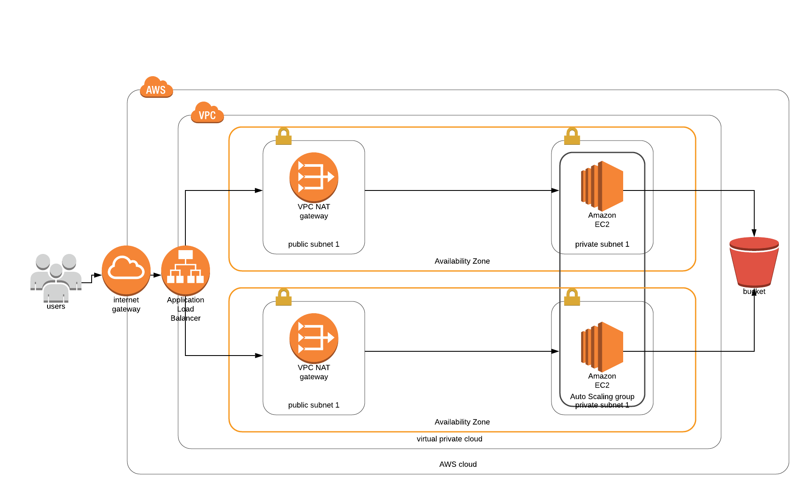

# High-availability application using CloudFormation

## Introduction

This is a [Cloud Formation] setup to deploy an Udagram for a highly available app as requirement to Cloud DevOps Nanodegre of [Udacity](https://www.udacity.com/).

## Architecture Diagram

